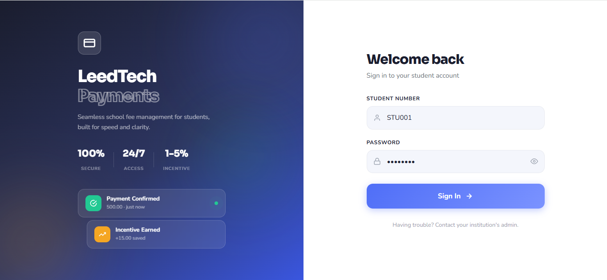
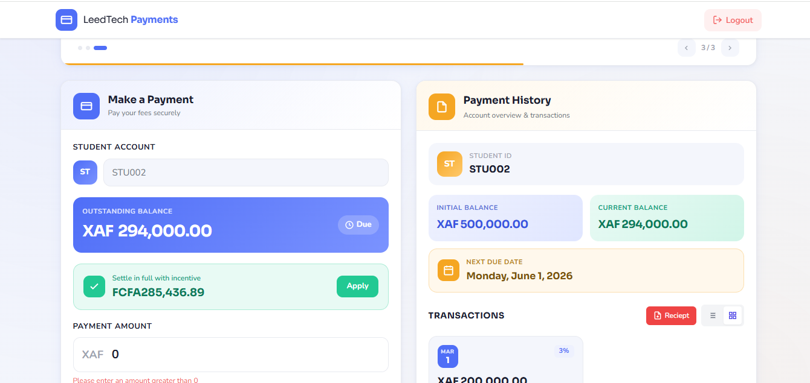
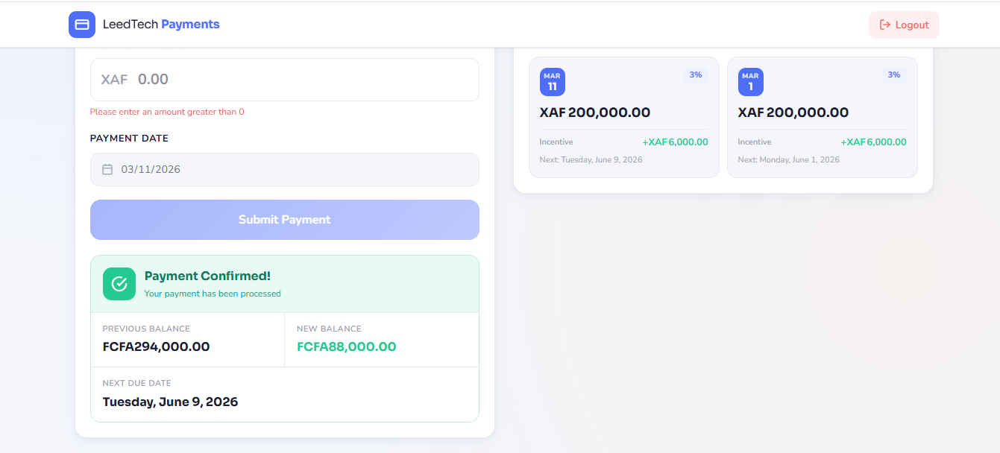

# LeedTech Student Fee One-Time Payment System

A full-stack application built with **Spring Boot** (backend) and **Angular** (frontend) that allows students to make one-time fee payments with incentive matching and automatic next due date calculation. The system maintains student account balances and payment history.


## Table of Contents

- [Overview](#overview)
- [Technologies Used](#technologies-used)
- [Prerequisites](#prerequisites)
- [Setup Instructions](#setup-instructions)
  - [Backend Setup](#backend-setup)
  - [Frontend Setup](#frontend-setup)
- [Running the Application](#running-the-application)
- [API Documentation](#api-documentation)
- [Features](#features)
- [Testing](#testing)
- [Assumptions & Trade-offs](#assumptions--trade-offs)
- [Project Structure](#project-structure)
- [Screenshots](#screenshots)
- [License](#license)

---

## Overview

This project implements a **one-time fee payment** feature for a student management platform. Students can log in, view their current balance and payment history, and make payments. Each payment earns an **incentive credit** based on the amount, and the next due date is calculated 90 days later (adjusted for weekends). The system prevents overpayments and provides a user-friendly interface with real-time validation.

---

## Technologies Used

### Backend
- **Java 17**
- **Spring Boot 4.0.3**
- **Spring Data JPA**
- **Spring Security** (JWT authentication)
- **H2 Database** (in-memory, for development)
- **Maven**

### Frontend
- **Angular 21**
- **Tailwind CSS** (for styling)
- **JWT Authentication** via HTTP interceptor

---

## Prerequisites

Ensure you have the following installed:

- **Java JDK 17** or later
- **Node.js 18+** and npm
- **Angular CLI** (`npm install -g @angular/cli`)
- **Maven** (or use the wrapper `./mvnw`)
- **Git**

---

## Setup Instructions

### 1. Clone the Repository

```bash
git clone https://github.com/BrayanMorningstar237/leedtech-fee-payment.git
cd leedtech-fee-payment
````

The repository contains two main folders:

* `backend/` – Spring Boot application
* `frontend/` – Angular application
# other folders
* `Postman Collection/` – Exported API Collection
* `screenshots/` – screenshots of ui
---

### Backend Setup

1. Navigate to the backend folder:

   ```bash
   cd backend
   ```

2. Build the project:

   ```bash
   mvn clean install
   ```

3. The application uses an **H2 in-memory database**. Initial data is loaded from `src/main/resources/data.sql`.
   You can modify this file to add more students or transactions.

4. (Optional) To change the database or JWT secret, update `src/main/resources/application.properties`.

---

### Frontend Setup

1. Navigate to the frontend folder:

   ```bash
   cd ../frontend
   ```

2. Install dependencies:

   ```bash
   npm install
   ```

3. The frontend expects the backend to run on `http://localhost:8080`. If you change the backend port, update the `apiUrl` in `src/app/services/*.ts` files.

4. Tailwind CSS is already configured. If you need to customize, edit `tailwind.config.js`.

---

## Running the Application

### Start the Backend

From the `backend` folder:

```bash
mvn spring-boot:run
```

The backend will start on **[http://localhost:8080](http://localhost:8080)**.
H2 console is available at `http://localhost:8080/h2-console` (JDBC URL: `jdbc:h2:mem:leedtechdb`, username: `sa`, password: blank).

### Start the Frontend

From the `frontend` folder (in a new terminal):

```bash
ng serve
```

The frontend will be available at **[http://localhost:4200](http://localhost:4200)**.

### Login Credentials

Two students are pre-loaded (from `data.sql`):

| Student Number | Password      | Initial Balance |
| -------------- | ------------- | --------------- |
| STU001         | `password` | 800,000.00       |
| STU002         | `password2` | 500,000.00      |

*Note: Passwords are hashed using BCrypt. The plaintext password for both is indicated above.*

---


---

## API Documentation

The backend exposes the following REST endpoints. All endpoints **except** `/api/auth/login` require a **Bearer JWT token** obtained after login.

### Authentication

**Login**

* **Method:** POST
* **Endpoint:** `/api/auth/login`
* **Description:** Authenticate student

**Request Body:**

```json
{
  "studentNumber": "STU001",
  "password": "password"
}
```

**Response:**

```json
{
  "success": true,
  "studentNumber": "STU001",
  "token": "jwt..."
}
```

---

### Payments

**Process a One-Time Payment**

* **Method:** POST
* **Endpoint:** `/api/one-time-fee-payment`
* **Description:** Process a payment

**Request Body:**

```json
{
  "studentNumber": "STU001",
  "paymentAmount": 200000,
  "paymentDate": "2026-03-10"
}
```

**Response:** Payment details with updated balance

---

**Get Student Account Info**

* **Method:** GET
* **Endpoint:** `/api/students/{studentNumber}/account`
* **Description:** Retrieve student account info

**Response:**

```json
{
  "studentNumber": "STU001",
  "balance": 275000,
  "nextDueDate": "2026-06-09"
}
```

---

**Get Payment History**

* **Method:** GET
* **Endpoint:** `/api/students/{studentNumber}/payments`
* **Description:** Retrieve payment history

**Response:**

```json
[
  {
    "paymentDate": "2026-03-10",
    "paymentAmount": 200000,
    "incentiveAmount": 6000
  },
  {
    "paymentDate": "2026-01-10",
    "paymentAmount": 75000,
    "incentiveAmount": 1500
  }
]
```

---

**Get Account Summary & Dashboard**

* **Method:** GET
* **Endpoint:** `/api/students/{studentNumber}/dashboard`
* **Description:** Retrieve account summary and payment history

**Response:**

```json
{
  "studentNumber": "STU001",
  "currentBalance": 69000,
  "initialBalance": 275000,
  "nextDueDate": "2026-06-09",
  "paymentHistory": [
    {
      "paymentDate": "2026-03-10",
      "paymentAmount": 200000,
      "incentiveAmount": 6000
    },
    {
      "paymentDate": "2026-01-10",
      "paymentAmount": 75000,
      "incentiveAmount": 1500
    }
  ]
}
```


### **Example Payment Request**

```json
POST /api/one-time-fee-payment
{
  "studentNumber": "STU001",
  "paymentAmount": 200000,
  "paymentDate": "2026-03-10"
}
```

**Response:**

```json
{
  "studentNumber": "STU001",
  "paymentAmount": 200000,
  "previousBalance": 275000,
  "incentiveRate": 0.03,
  "incentiveAmount": 6000,
  "newBalance": 69000,
  "nextDueDate": "2026-06-09"
}
```

---

## Features

### Backend

* JWT authentication with BCrypt password hashing
* Payment processing with incentive calculation (1%, 3%, 5%)
*  Next due date logic: 90 days from payment, adjusted for weekends
*  Prevention of overpayments (balance cannot go negative)
*  Payment history tracking
*  RESTful API design
*  In-memory H2 database for easy testing

### Frontend

*  Responsive, mobile-first design (Tailwind CSS)
*  Login page with form validation
*  Real-time payment amount validation (shows total deduction)
*  Payoff suggestion button (calculates exact amount to zero out balance)
*  Student dashboard with:

  * Account summary cards (initial balance, current balance, next due date)
  * Payment history with toggle between **list (table)** and **grid (cards)** views
  * "Paid in full" badge when balance reaches zero
*  Auto-refresh dashboard after successful payment
*  Tabs on mobile to switch between payment form and dashboard
*  Disabled date input showing current system date

---

## Testing

---

This project includes **unit tests** and **integration tests** for both the **service** and **controller layers**. These tests validate fee payments, incentive calculations, and API behavior(backend).

---

### 1. Controller Layer Example (`FeePaymentController`)

**Controller method – handling a one-time fee payment:**

```java
@PostMapping("/api/one-time-fee-payment")
public FeePayment makePayment(@RequestBody FeePayment request) {
    return feePaymentService.processPayment(request);
}
```

**Test cases for this controller method (`FeePaymentControllerTest`):**

**Valid payment request:**

```java
@Test
@WithMockUser
void makePayment_ValidRequest_ShouldReturnOk() throws Exception {
    when(feePaymentService.processPayment(any(FeePayment.class))).thenReturn(validResponse);

    mockMvc.perform(post("/api/one-time-fee-payment")
                    .contentType(MediaType.APPLICATION_JSON)
                    .content(objectMapper.writeValueAsString(validRequest)))
           .andExpect(status().isOk())
           .andExpect(jsonPath("$.studentNumber").value("STU001"))
           .andExpect(jsonPath("$.newBalance").value(594000))
           .andExpect(jsonPath("$.incentiveRate").value(0.03));
}
```

**Invalid payment amount:**

```java
@Test
@WithMockUser
void makePayment_InvalidAmount_ShouldReturnBadRequest() throws Exception {
    FeePayment invalidRequest = new FeePayment();
    invalidRequest.setStudentNumber("STU001");
    invalidRequest.setPaymentAmount(new BigDecimal("-100"));

    when(feePaymentService.processPayment(any(FeePayment.class)))
        .thenThrow(new IllegalArgumentException("Payment must be greater than zero"));

    mockMvc.perform(post("/api/one-time-fee-payment")
                    .contentType(MediaType.APPLICATION_JSON)
                    .content(objectMapper.writeValueAsString(invalidRequest)))
           .andExpect(status().isBadRequest())
           .andExpect(content().string("Payment must be greater than zero"));
}
```

**Fetching student dashboard:**

```java
@GetMapping("/api/students/{studentNumber}/dashboard")
public StudentDashboard getStudentDashboard(@PathVariable String studentNumber) {
    return feePaymentService.getStudentDashboard(studentNumber);
}
```

**Corresponding test:**

```java
@Test
@WithMockUser
void getStudentDashboard_ShouldReturnOk() throws Exception {
    StudentAccount student = new StudentAccount("STU001", new BigDecimal("594000"), "password123");
    when(studentAccountRepository.findById("STU001")).thenReturn(Optional.of(student));

    List<PaymentTransaction> transactions = List.of(
        new PaymentTransaction("STU001", new BigDecimal("200000"), new BigDecimal("6000"), 0.03, LocalDate.now(), LocalDate.now().plusDays(90))
    );
    when(paymentTransactionRepository.findByStudentNumberOrderByPaymentDateDesc("STU001"))
        .thenReturn(transactions);

    var response = mockMvc.perform(get("/api/students/STU001/dashboard"))
                          .andExpect(status().isOk())
                          .andReturn()
                          .getResponse()
                          .getContentAsString();

    StudentDashboard dashboard = objectMapper.readValue(response, StudentDashboard.class);

    assertEquals(new BigDecimal("594000"), dashboard.getCurrentBalance());
    assertEquals(new BigDecimal("800000"), dashboard.getInitialBalance());
    assertEquals(1, dashboard.getPaymentHistory().size());
}
```

---

### 2. Service Layer Example (`FeePaymentService`)

**Service method – processing a payment and calculating incentives:**

```java
public FeePayment processPayment(FeePayment request) {
    StudentAccount student = studentAccountRepository.findById(request.getStudentNumber())
        .orElseThrow(() -> new IllegalArgumentException("Student not found"));

    BigDecimal previousBalance = student.getBalance();
    BigDecimal paymentAmount = request.getPaymentAmount();

    if(paymentAmount.compareTo(BigDecimal.ZERO) <= 0)
        throw new IllegalArgumentException("Payment must be greater than zero");
    if(paymentAmount.compareTo(previousBalance) > 0)
        throw new IllegalArgumentException("Payment exceeds current balance");

    double incentiveRate = calculateIncentive(paymentAmount);
    BigDecimal incentiveAmount = paymentAmount.multiply(BigDecimal.valueOf(incentiveRate));
    BigDecimal newBalance = previousBalance.subtract(paymentAmount.add(incentiveAmount));

    student.setBalance(newBalance);
    studentAccountRepository.save(student);

    // Save transaction
    PaymentTransaction transaction = new PaymentTransaction(student.getStudentNumber(), paymentAmount, incentiveAmount, incentiveRate, LocalDate.now(), LocalDate.now().plusDays(90));
    paymentTransactionRepository.save(transaction);

    return new FeePayment(student.getStudentNumber(), paymentAmount, previousBalance, incentiveRate, incentiveAmount, newBalance, LocalDate.now().plusDays(90));
}
```

**Tests for different scenarios (`FeePaymentServiceTest`):**

**Valid payment with 3% incentive:**

```java
@Test
void processPayment_ValidAmount100K_ShouldApply3PercentIncentive() {
    request.setPaymentAmount(new BigDecimal("100000"));
    when(studentAccountRepository.findById("STU001")).thenReturn(Optional.of(student));

    FeePayment response = feePaymentService.processPayment(request);

    assertEquals(0, new BigDecimal("800000").compareTo(response.getPreviousBalance()));
    assertEquals(0.03, response.getIncentiveRate());
    assertEquals(0, new BigDecimal("3000").compareTo(response.getIncentiveAmount()));
    assertEquals(0, new BigDecimal("697000").compareTo(response.getNewBalance()));
}
```

**Overpayment – should throw exception:**

```java
@Test
void processPayment_Overpayment_ShouldThrowException() {
    request.setPaymentAmount(new BigDecimal("900000"));
    when(studentAccountRepository.findById("STU001")).thenReturn(Optional.of(student));

    assertThrows(IllegalArgumentException.class,
                 () -> feePaymentService.processPayment(request));
}
```

**Zero or negative payment – should throw exception:**

```java
@Test
void processPayment_ZeroAmount_ShouldThrowException() {
    request.setPaymentAmount(BigDecimal.ZERO);
    assertThrows(IllegalArgumentException.class,
                 () -> feePaymentService.processPayment(request));
}
```


### What these tests are verifying:

1. **Controller Layer**

   * API endpoints return the correct **HTTP status codes**.
   * Valid requests return correct **JSON response**.
   * Invalid requests (overpayment, negative payment) return **descriptive errors**.

2. **Service Layer**

   * Incentives are calculated correctly for different payment tiers.
   * Balances are updated accurately.
   * Invalid payments are rejected with **exceptions**.
   * Transactions are saved correctly.


### Frontend Tests

From the `frontend` folder:

```bash
ng test
```

(Currently, frontend tests are minimal;)

### Manual Testing 

Import the provided Postman collection or test endpoints manually using the JWT token obtained from login.

### Manual Testing with Postman

1. **Import the Collection**  
   The Postman collection is included in this repository. You can import it into Postman:

   [LeedTech Fee Payment API Postman Collection](Postman%20Collection/LeedTech%20Fee%20Payment%20API.postman_collection.json)

2. **Authentication**  
   Use the `/api/auth/login` endpoint to obtain a JWT token.  
   Copy the token and set it as a **Bearer Token** in the **Authorization** header for all other endpoints.

3. **Available Endpoints**  
   | Method | Endpoint | Description |
   |--------|---------|-------------|
   | POST   | `/api/auth/login` | Login and get JWT token |
   | POST   | `/api/one-time-fee-payment` | Make a one-time fee payment |
   | GET    | `/api/students/{studentNumber}/account` | Get student account info |
   | GET    | `/api/students/{studentNumber}/payments` | Get student payment history |
   | GET    | `/api/students/{studentNumber}/dashboard` | Get student dashboard summary |

4. **Usage**  
   - Replace `{studentNumber}` with the actual student number.  
   - Make sure the backend is running locally (e.g., `http://localhost:8080`).  
   - Test requests directly via Postman using the imported collection.
---

## Assumptions & Trade-offs

Throughout development, I made several deliberate choices to balance simplicity, adherence to requirements, and practicality. Below is a summary of those decisions and the reasoning behind them.

###  **Database: In-Memory H2 for Development**
- **Assumption:** Using an H2 in-memory database provides a lightweight, zero‑configuration environment suitable for demonstration and testing.  
- **Trade-off:** Data is lost on application restart. In production, this would be replaced with a persistent database (e.g., PostgreSQL, MySQL) by updating `application.properties`. The JPA layer abstracts the database, making the switch straightforward.

###  **Authentication: JWT with localStorage**
- **Assumption:** Storing the JWT token in `localStorage` is acceptable for a demo. It allows the frontend to persist the session across page refreshes without complex back‑end session management.  
- **Trade-off:** `localStorage` is vulnerable to XSS attacks. For a production system, I would use HttpOnly cookies with secure flags to mitigate this risk. The focus of this exercise is on the payment logic, not production‑grade security.

###  **Password Hashing: BCrypt with Pre‑loaded Data**
- **Assumption:** Passwords are pre‑hashed in `data.sql` using [bcrypt-generator.com](https://bcrypt-generator.com/). This allows immediate login with the provided test credentials:  
  - `STU001` – password: `password`  
  - `STU002` – password: `password2`  
- **Trade-off:** The login system is not the primary focus, so I did not implement user registration or password change flows. New users must be inserted manually with their own BCrypt‑hashed passwords. The authentication endpoint validates credentials correctly, fulfilling the requirement.

###  **Incentive Tier Boundaries**
- **Assumption:** The incentive tiers are inclusive of the lower bound (e.g., exactly 100K qualifies for 3%, exactly 500K qualifies for 5%). This matches the specification and ensures consistent behaviour at the thresholds.  
- **Trade-off:** No special handling for values like 99,999.99 (falls into the 1% tier) – which is exactly as required.

###  **Weekend Adjustment for Due Dates**
- **Assumption:** If the calculated due date falls on a Saturday or Sunday, it is moved to the following Monday. This satisfies the requirement that no due date may be on a weekend.  
- **Trade-off:** The example in the specification had a minor typo (July 5, 2026 is a Sunday, but the logic correctly moves it to Monday). The implementation follows the exact rule, not the example’s erroneous date.

###  **90‑Day Due Date: Fixed Rule vs. Real‑World Adaptability**
- **Assumption:** The requirement states that the next due date is always 90 days from the payment date, regardless of the amount paid. While this is simple to implement and ensures predictability, it may lead to scenarios where a student who pays a very small amount (e.g., 10,000 XAF) still gets a full 90‑day window, which could feel disconnected from the actual outstanding balance.  
- **Trade-off:** In a real‑world system, a more adaptive installment plan might be preferable – for instance, dividing the remaining balance into equal monthly payments or linking the due date to the payment amount. However, the current implementation strictly follows the given specification.  
- **Future Enhancement:** A possible improvement would be to introduce **standard one‑time installment plans** where the number of days until the next due date could be scaled based on the payment size, thereby better aligning incentives and keeping students engaged. This would also enhance the purpose of the incentive program.

###  **Balance Becoming Zero**
- **Assumption:** When a payment reduces the balance to exactly zero, the student is considered paid in full. Consequently, the `nextDueDate` is set to `null`, and the dashboard displays a “Paid in full” message.  
- **Trade-off:** This behaviour is intuitive and prevents the system from showing a due date when no balance remains.

###  **Frontend State Management**
- **Assumption:** The student number is stored in `localStorage` and also maintained in a `BehaviorSubject` within the `AuthService`. This allows the application to remember the logged‑in user across browser refreshes and provide reactive updates to components.  
- **Trade-off:** As noted earlier, `localStorage` has security implications, but for the scope of this exercise it provides a simple and effective state persistence mechanism.

###  **Mobile‑First UI Design**
- **Assumption:** The interface is built with a mobile‑first approach using Tailwind CSS, ensuring it works flawlessly on small screens. Components like the payment form and dashboard cards are fully responsive and tested down to 320px width.  
- **Trade-off:** Some interactive elements (e.g., the PDF report button) hide their text labels on very small screens to save space, but the functionality remains accessible via the icon.

###  **PDF Report Generation**
- **Assumption:** Including a PDF receipt generator adds value by allowing students to download their payment history. The `jspdf` and `jspdf-autotable` libraries were chosen for their ease of integration.  
- **Trade-off:** The PDF is generated entirely on the client side; in a real application, you might want a server‑generated version for archival or compliance, but for this exercise the client‑side approach is sufficient.

###  **Test Coverage**
- **Assumption:** Unit tests for the service layer (incentive calculation, due date logic, validation) and controller integration tests adequately cover the business logic. Mocking repositories isolates the service, ensuring fast and reliable tests.  
- **Trade-off:** Repository layer tests with an embedded database were omitted to keep the test suite simple, but they could be added if persistence logic becomes more complex.

---

##  Future Enhancements (Ideas for Discussion)

- **Adaptive Due Dates:** Replace the fixed 90‑day rule with a sliding scale that ties the next due date to the payment amount or the remaining balance, making the system more responsive and fair.  
- **Installment Plans:** Introduce predefined installment options (e.g., 3, 6, or 12 months) that students can select during payment, with the incentive rate possibly adjusted accordingly.  
- **Email Notifications:** Send students a confirmation email after each payment, including a PDF receipt.  
- **Audit Logs:** Maintain a secure log of all payment activities for administrative review.

These enhancements would further align the system with real‑world financial platforms while preserving the core functionality evaluated in this exercise.

## Project Structure

```
leedtech-fee-payment/
├── backend/
│   ├── src/main/java/com/leedtech/
│   │   ├── controller/
│   │   ├── model/
│   │   ├── repository/
│   │   ├── security/
│   │   ├── service/
│   │   └── test\java\com\leedtech
│   ├── src/main/resources/
│   │   ├── application.properties
│   │   └── data.sql
│   └── pom.xml
├── frontend/
│   ├── src/app/
│   │   ├── services/
│   │   ├── login/
│   │   ├── payment-form/
│   │   ├── dashboard/
│   │   ├── app.ts
│   │   └── app.config.ts
│   │   └── info-slideshow
│   ├── styles.css
│   ├── index.html
│   ├── angular.json
│   ├── package.json
│   ├── tailwind.config.js
│   └── .postcssrc.json
└── README.md
└── Postman Collection
└── screenshots
```

---


## Screenshots

**Login Page**


**Dashboard (Grid View)**


**Payment Form**



---

## License

This project is created for the LeedTech interview exercise and is not intended for production use.

---

**&copy; Ndefru Brayan** 

```
END
```
